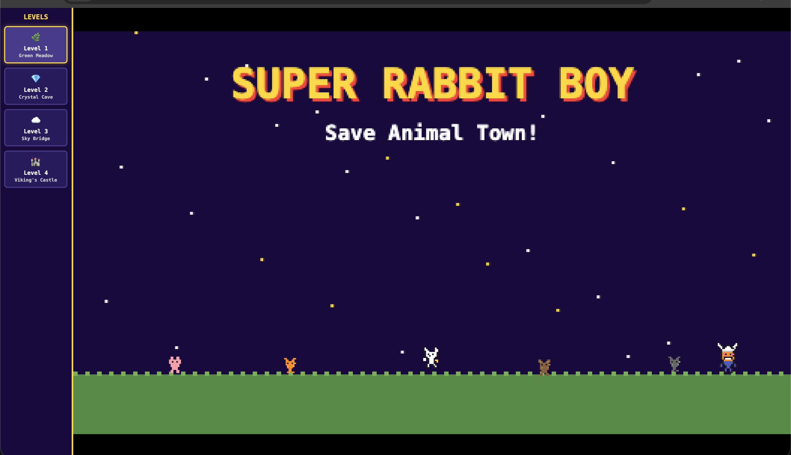

# Super Rabbit Boy: Save Animal Town!



A one-button auto-runner platformer for young kids, inspired by Thomas Flintham's "Press Start" book series.

## How to Play

- **Desktop**: Open `index.html` in any browser. Press **Space** to jump. Arrow keys for boss level.
- **iPad**: Use `ipad.html` (see below).

## Running on iPad

1. Make sure your Mac and iPad are on the **same WiFi network**
2. Start a local server on your Mac:
   ```bash
   cd /Users/nanwang/Codes/nan/html_game_20260313
   python3 -m http.server 8080
   ```
3. Find your Mac's local IP:
   ```bash
   ipconfig getifaddr en0
   ```
4. On iPad Safari, open: `http://<YOUR_MAC_IP>:8080/ipad.html`
5. **Optional — Add to Home Screen**: Tap the Share button → "Add to Home Screen" for a fullscreen app-like experience

## Game Overview

- **4 Levels**: Green Meadow → Crystal Cave → Sky Bridge → Viking's Castle
- **Controls**: Tap/Space to jump (auto-runner). Boss level has manual left/right movement.
- **No failure state**: Pits respawn you instantly, robots just bounce you back
- **Boss fight**: Jump on King Viking's head 3 times to defeat him!
