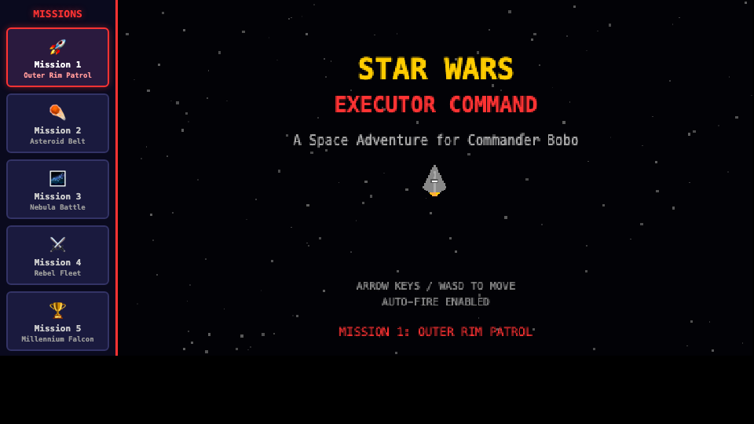

# Star Wars: Executor Command



A kid-friendly top-down space shooter for young players. Command Darth Vader's Executor Star Destroyer and battle Rebel ships across 5 missions, ending with a Millennium Falcon boss fight.

## How to Play

- **Desktop**: Open `index.html` in any browser. Arrow keys / WASD to move. Ship fires automatically.
- **iPad**: Use `ipad.html` (see below). Touch and drag to move. Ship fires automatically.

## Running on iPad

1. Make sure your Mac and iPad are on the **same WiFi network**
2. Start a local server on your Mac:
   ```bash
   cd /Users/nanwang/Codes/nan/claude_games_for_bobo/20260314_starwars
   python3 -m http.server 8080
   ```
3. Find your Mac's local IP:
   ```bash
   ipconfig getifaddr en0
   ```
4. On iPad Safari, open: `http://<YOUR_MAC_IP>:8080/ipad.html`
5. **Optional -- Add to Home Screen**: Tap the Share button -> "Add to Home Screen" for a fullscreen app-like experience

## Game Overview

- **5 Missions**: Outer Rim Patrol -> Asteroid Belt -> Nebula Battle -> Rebel Fleet -> Millennium Falcon
- **4 Enemy Types**: X-wings, A-wings (zigzag), Y-wings (tough, drop power-ups), B-wings (3 HP)
- **Boss Fight**: Millennium Falcon with 3 phases -- it escapes to hyperspace when defeated
- **Power-ups**: Weapon upgrades (single/double/triple shot), proton torpedoes, shield recharge
- **No game over**: Shields auto-recharge when depleted -- encouraging messages keep kids motivated
- **Victory**: Imperial March melody and confetti celebration
