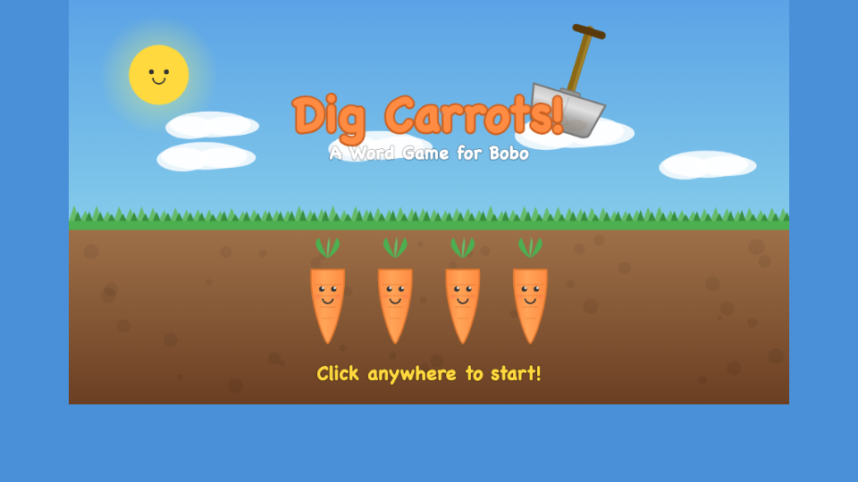

# Dig Carrots! - A Word Game for Bobo



A cheerful word/phonics game for young readers (Grade 1-2). Words appear on a shovel blade with missing letters shown as bouncing question marks. Pick the right carrot to fill in the blanks and watch the shovel dig it out!

## How to Play

- **Desktop**: Open `index.html` in any browser. Click the carrot with the correct missing letters.
- **iPad**: Use `ipad.html` (see below). Tap the carrot with the correct missing letters.

## Running on iPad

1. Make sure your Mac and iPad are on the **same WiFi network**
2. Start a local server on your Mac:
   ```bash
   cd /Users/nanwang/Codes/nan/claude_games_for_bobo/20260315_dig_carrots
   python3 -m http.server 8080
   ```
3. Find your Mac's local IP:
   ```bash
   ipconfig getifaddr en0
   ```
4. On iPad Safari, open: `http://<YOUR_MAC_IP>:8080/ipad.html`
5. **Optional -- Add to Home Screen**: Tap the Share button -> "Add to Home Screen" for a fullscreen app-like experience

## Game Overview

- **60 words** from Grade 1-2 vocabulary (e.g., VOLCANO, ERUPTION, WATER, CLIMB, STORY, THINK)
- **16 rounds** per game, shuffled from the word pool
- **2 letters masked** per word -- each carrot shows a letter combo (with `..` separating non-adjacent letters)
- **10-second timer** per round with ticking countdown in the last 3 seconds
- **Shovel dig animation**: correct carrot triggers a shovel swing-down, scoop with dirt particles, and fly-up carry
- **Encouraging tone**: no penalty for wrong answers, personalized messages for Bobo at game over
- **Celebration ribbons** on the ending screen

## Features

- Cute cartoon carrots with expressive faces (happy, worried, rotten)
- Shovel-shaped word display with metal blade, wooden handle, and T-grip
- Sparkle and dirt particle effects
- Web Audio API sound effects (correct arpeggio, wrong buzz, dig thud, timer ticks)
- Pre-rendered background for smooth performance
