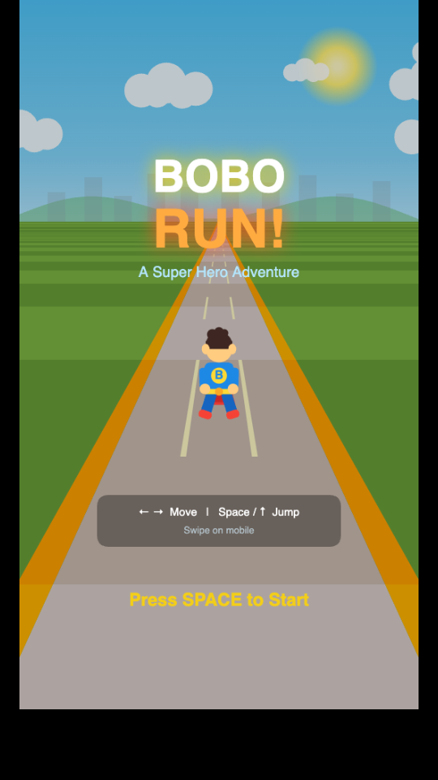

# Bobo Run!



A modern 3D endless runner for Bobo. Super hero Bobo sprints down a road, dodging creatures and collecting coins in a 2-minute adventure.

## How to Play

- **Desktop**: Open `index.html` in any browser.
  - **Left / Right Arrow**: Switch lanes
  - **Space / Up Arrow**: Jump over obstacles
- **Mobile**: Swipe left/right to switch lanes, swipe up to jump, tap to start.

## Game Overview

- **3 Lanes**: Dodge obstacles by switching lanes or jumping over them
- **Coins**: Collect spinning gold coins for points. Every 10 coins increases your score multiplier (up to x5)
- **3 Phases** (40 seconds each):
  1. **Pufferfish** -- spiny yellow puffballs with surprised faces
  2. **+ Monsters** -- purple horned blobs with angry eyes and jagged teeth
  3. **+ Dragons** -- green dragons with flapping wings, smoke-breathing nostrils, and spiked tails
- **No death**: Hitting a creature causes a screen shake and brief slowdown with an encouraging message -- Bobo keeps running!
- **Score**: Collect coins, build combos, and aim for the highest score in 2 minutes

## Running Locally

```bash
cd 20260320_bobo_run
open index.html
```
